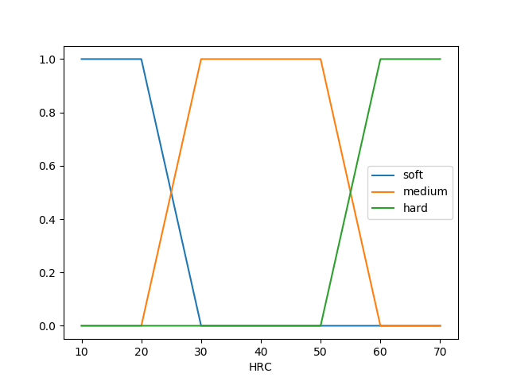
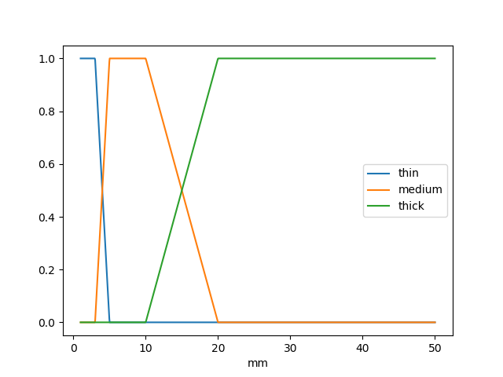
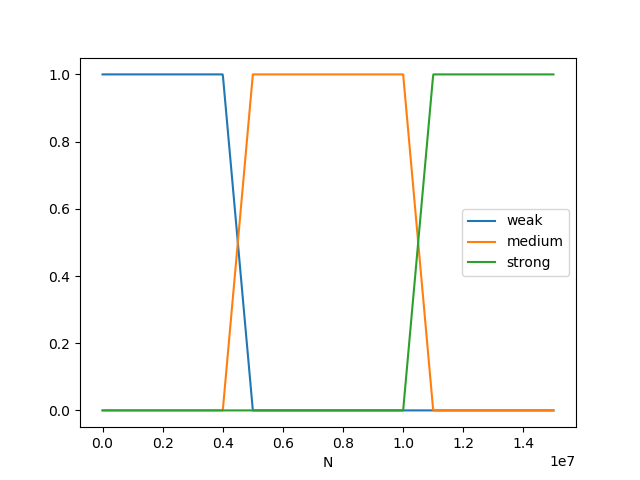

# Sterowanie rozmyte

10. Zaprojektować system sterowania rozmytego sterującego siłą nacisku
ostrza w zależności od twardości i grubości płyty metalowej.

## 1. Założenia

1. Twardość płyty podzielimy na [M]iękką, [S]rednio twardą oraz [T]wardą

    
    
    ```
    M = {
      1, x <= 20
      1-(x-20)/10, 20 < x < 30
      0, x >= 30
    }
    ```
    
    ```
    S = {
      1, 30 <= x <= 50,
      (x-20)/10, 20 < x < 30
      1-(x-20)/10, 50 < x < 60
      0, x <= 20 U x >= 60
    }
    ```
    
    ```
    T = {
      1, x >= 60,
      (x-20)/10, 50 < x < 60
      0, x <= 50
    }
    ```

2. Grubość płyty podzielimy na [C]ienką, [S]rednio grubą oraz [G]rubą

    
    
    ```
    C = {
      1, x <= 3
      1-(x-3)/2, 3 < x < 5
      0, x >= 5
    }
    ```
    
    ```
    S = {
      1, 5 <= x <= 10,
      (x-3)/2, 3 < x < 5
      1-(x-10)/10, 10 < x < 20
      0, x <= 3 U x >= 20
    }
    ```
    
    ```
    G = {
      1, x >= 20,
      (x-10)/10, 10 < x < 20
      0, x <= 10
    }
    ```

3. Siłę nacisku podzielimy na [S]łabą, [U]miarkowaną oraz [M]ocną

    
    
    ```
    S = {
      1, x <= 4e6
      1-(x-4e6)/1e6, 4e6 < x < 5e6
      0, x >= 5e6
    }
    ```
    
    ```
    U = {
      1, 5e6 <= x <= 11e6,
      (x-4e6)/1e6, 20 < x < 30
      1-(x-4e6)/1e6, 50 < x < 60
      0, x <= 4e6 U x >= 11e6
    }
    ```
    
    ```
    M = {
      1, x >= 11e6,
      (x-4e6)/1e6, 10e6 < x < 11e6
      0, x <= 10e6
    }
    ```

## 2. Baza reguł

| Twardość | Grubość | Siła |
|---|---|---|
| M | C | S |
| M | S | S |
| M | G | U |
| S | C | S |
| S | S | U |
| S | G | M |
| T | C | S |
| T | S | U |
| T | G | M |

## Przykład

* Twardość: 21 HRC
* Grubość: 16 mm

Obliczamy stopnie twardości i grubości:

* Twardość
  * Miękka: `1-(x-20)/10 = 1-(21-20)/10 = 1-1/10 = 1-0.1 = 0.9`
  * Średnio twarda: `(x-20)/10 = (21-20)/10 = 1/10 = 0.1`
  
* Grubość
  * Średnio gruba: `1-(x-10)/10 = 1-(16-10)/10 = 1-6/10 = 1-0.6 = 0.4`
  * Gruba: `(x-10)/10 = (16-10)/10 = 6/10 = 0.6`


