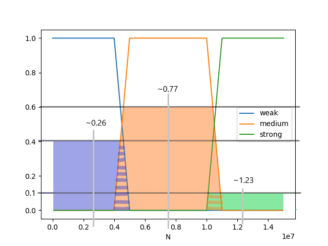

# Sterowanie rozmyte

10. Zaprojektować system sterowania rozmytego sterującego siłą nacisku
ostrza w zależności od twardości i grubości płyty metalowej.

System sterowania musi wziąć pod uwagę grubość ciętej płyty oraz twardość
materiału z którego została wykonana. Więcej materiału do przecięcia oznacza
koniecznośc wytworzenia większej siły. Tak jak i większa twardośc materiału.

## 1. Założenia

0. Im twardsza i grubsza płyta, tym więcej siły będzie niezbędne do przecięcia jej.

1. Twardość płyty podzielimy na [M]iękką, [S]rednio twardą oraz [T]wardą.

    Zastosowany przedział [10, 70] bazowany jest na skali HRC, w której
    najtwardsza stal ma 70 HRC, a najbardziej miękkie stopy około 20.

    
    
    Funkcje przynależności:
    
    ```
    M = {
      1, x <= 20
      1-(x-20)/10, 20 < x < 30
      0, x >= 30
    }
    ```
    
    ```
    S = {
      1, 30 <= x <= 50,
      (x-20)/10, 20 < x < 30
      1-(x-20)/10, 50 < x < 60
      0, x <= 20 U x >= 60
    }
    ```
    
    ```
    T = {
      1, x >= 60,
      (x-20)/10, 50 < x < 60
      0, x <= 50
    }
    ```

2. Grubość płyty podzielimy na [C]ienką, [S]rednio grubą oraz [G]rubą

    Zastosowany przedział uwzględnia blachy o grubości poniżej 5 milimetrów,
    płytki grubości poniżej dwóch centymetrów, oraz grube płyty powyżej 2
    centymetrów

    
    
    Funkcje przynależności:
    
    ```
    C = {
      1, x <= 3
      1-(x-3)/2, 3 < x < 5
      0, x >= 5
    }
    ```
    
    ```
    S = {
      1, 5 <= x <= 10,
      (x-3)/2, 3 < x < 5
      1-(x-10)/10, 10 < x < 20
      0, x <= 3 U x >= 20
    }
    ```
    
    ```
    G = {
      1, x >= 20,
      (x-10)/10, 10 < x < 20
      0, x <= 10
    }
    ```

3. Siłę nacisku podzielimy na [S]łabą, [U]miarkowaną oraz [M]ocną

    Przedział mierzony jest w Niutonach, bazowany jest pomiędzy siłą
    ludzkich rąk, a siłą jaką wytwarzają prasy hydrauliczne stosowane
    do obróbki metali.

    
    
    Funkcje przynależności:
    
    ```
    S = {
      1, x <= 4e6
      1-(x-4e6)/1e6, 4e6 < x < 5e6
      0, x >= 5e6
    }
    ```
    
    ```
    U = {
      1, 5e6 <= x <= 11e6,
      (x-4e6)/1e6, 20 < x < 30
      1-(x-4e6)/1e6, 50 < x < 60
      0, x <= 4e6 U x >= 11e6
    }
    ```
    
    ```
    M = {
      1, x >= 11e6,
      (x-4e6)/1e6, 10e6 < x < 11e6
      0, x <= 10e6
    }
    ```

## 2. Baza reguł

| Twardość | Grubość | Siła |
|---|---|---|
| M | C | S |
| M | S | S |
| M | G | U |
| S | C | S |
| S | S | U |
| S | G | M |
| T | C | S |
| T | S | U |
| T | G | M |

## Przykład

* Twardość: 21 HRC
* Grubość: 16 mm

Obliczamy stopnie twardości i grubości:

* Twardość
  * Miękka: `1-(x-20)/10 = 1-(21-20)/10 = 1-1/10 = 1-0.1 = 0.9`
  * Średnio twarda: `(x-20)/10 = (21-20)/10 = 1/10 = 0.1`
  * Twarda: 0
  
* Grubość
  * Cienka: 0
  * Średnio gruba: `1-(x-10)/10 = 1-(16-10)/10 = 1-6/10 = 1-0.6 = 0.4`
  * Gruba: `(x-10)/10 = (16-10)/10 = 6/10 = 0.6`

Tworzymy macierz wartości siły:

| Twardość \ Grubość | 0 | 0.4 | 0.6 |
|---|---|---|---|
| 0.9 | 0 | 0.4 | 0.6 |
| 0.1 | 0 | 0.1 | 0.1 |
| 0 | 0 | 0 | 0 |

I nakładamy ją na macierz określeń siły:

| Twardość \ Grubość | C | S | G |
|---|---|---|---|
| M | S | S | U |
| S | S | U | M |
| T | S | U | M |

Co daje nam następujące wartości:

* `S = max(0, 0, 0, 0.4) = 0.4`
* `U = max(0, 0.1, 0.6) = 0.6`
* `M = max(0, 0.1) = 0.1`

Które dają następujący graf wyostrzania:



Do wyostrzenia i wyprowadzenia ostatecznej wartości siły nacisku, zastosujemy
wzór

```
F = (C1 * P1 + C2 * P2 + C3 * P3) / (P1 + P2 + P3)
```

* C1 = ~0.26
* C2 = ~0.77
* C3 = ~1.23

* `P1 = 0.5 * (0.46 + 0.5) * 0.4 = 0.5 * 0.96 * 0.4 = 0.192`
* `P2 = 0.5 * (0.58 + 0.7) * 0.6 = 0.5 * 1.28 * 0.6 = 0.384`
* `P3 = 0.5 * (0.49 + 0.5) * 0.1 = 0.5 * 0.99 * 0.1 = 0.0495`

Ostatecznie,

```
F = (0.26 * 0.192 + 0.77 * 0.384 + 1.23 * 0.0495) / (0.192 + 0.384 + 0.0495)
F = (0,04992 + 0,29568 + 0,060885) / 0,6255
F = 0,406485 / 0.6255
F = 0,6498561151079137
```

Tak więc niezbędna siła musiałaby wynosić ~0.65e6 N (~650 kN)